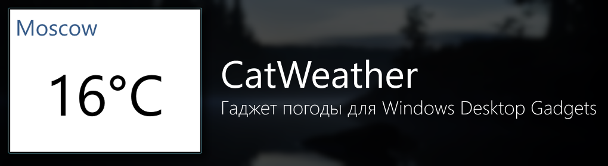
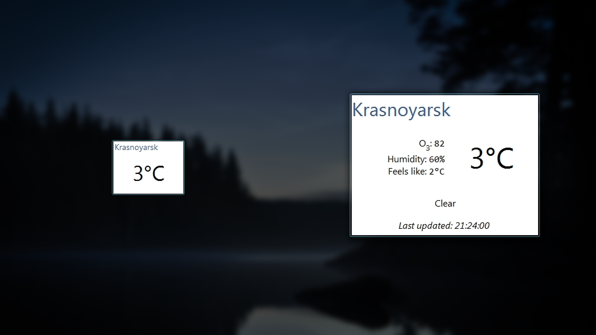
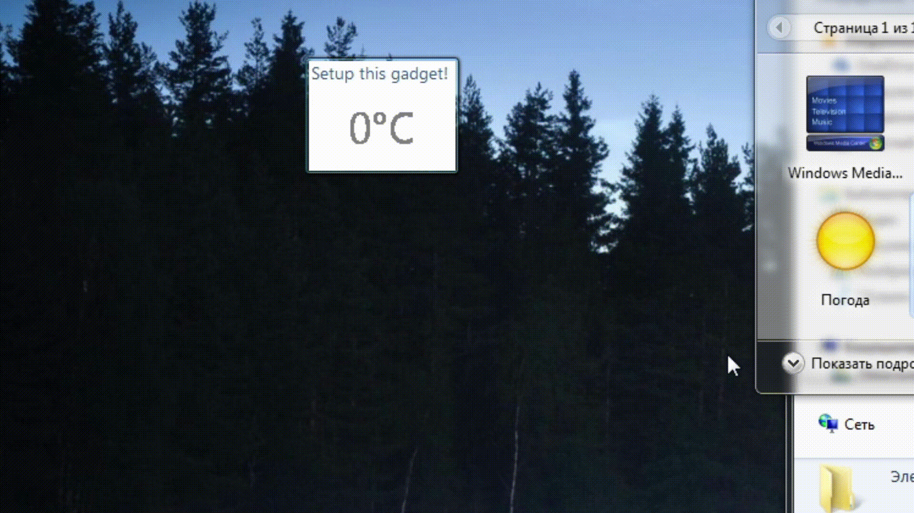
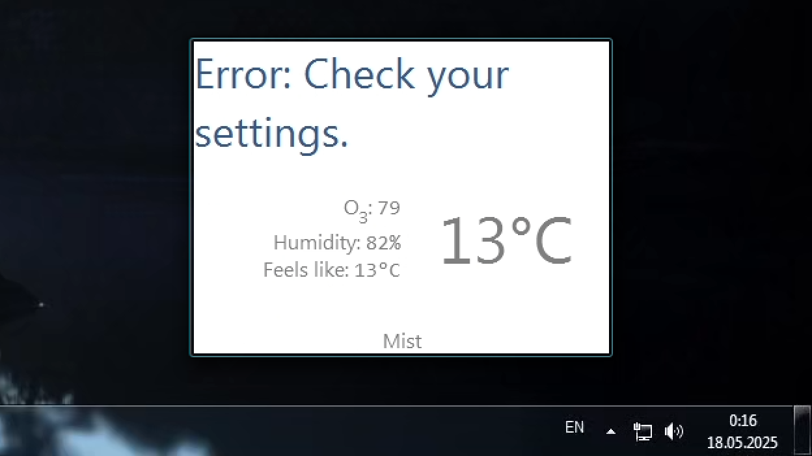
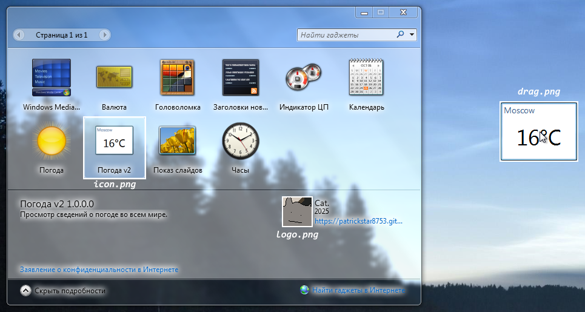

Рабочий гаджет погоды с Weatherstack API. Оформлен в стиле Windows Aero.

Гаджет умеет показывать город и температуру в миниатюрном виде, а также загрязненность и влажность воздуха, как ощущается температура и погодные условия в развернутом виде.

# Установка гаджета
Устаовка происходит в пару кликов:
1. Скачайте архив при помощи кнопки `Code -> Download ZIP`
2. Достаньте папку из архива и переименуйте её в `CatWeather.Gadget`
3. Переместите папку в `C:\Program Files\Windows Sidebar\Gadgets`
4. Готово!

# Настройка гаджета
При первом использовании гаджет попросит настроить его. Для этого зайдите в настройки гаджета.

Внутри настроек всего 3 пункта:
1. Ключ от Weatherstack API _(получить можно по ссылке, указанная в настройках гаджета)_
2. Нужный город на латинице.
3. Интервал обновления в минутах

Если параметры будут некорректны, гаджет сообщит об этом.

# Справочник по файлам

| Файл        | Назначение  |
| ----------- | ----------- |
| `/drag.png`   | Картинка, которая показывается при перемещенни каджета с окна выбора гаджетов на рабочий стол. Должна быть равна размеру гаджета.        |
| `/icon.png`   | Картинка, которая показывается в окне выбора гаджетов. |
| `/logo.png`   | Логотип организации, который показывается в подробностях гаджета. |

